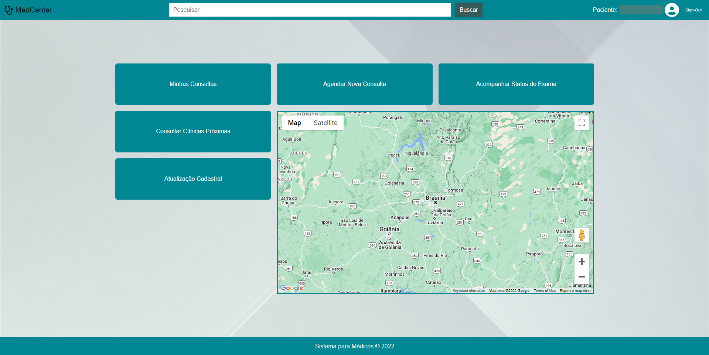

<!--
Copyright © and authorship:

Lucas Nogueira <https://github.com/llunno>;
Matias Reinke <https://github.com/MatyOS25>;
Bruno Rudy <https://github.com/BK-Rudy>;
Pedro Fonseca <https://github.com/pefonseca>;

Attribution Required.
-->

# MedCenter

#### Uma aplicação web focada em prover um espaço interativo, onde as consultas podem ser solicitadas de acordo com critérios específicos, agendadas e acompanhadas pelos pacientes com o auxilio de um médico responsável.

##### A web application focused on providing an interactive space, where consultations can be requested according to specific criteria, scheduled and monitored by patients with the help of a responsible doctor.




## Project setup
```
npm install
```

### Compiles and hot-reloads for development
```
npm run serve
```

### Compiles and minifies for production
```
npm run build
```

### Customize configuration
See [Configuration Reference](https://cli.vuejs.org/config/).
